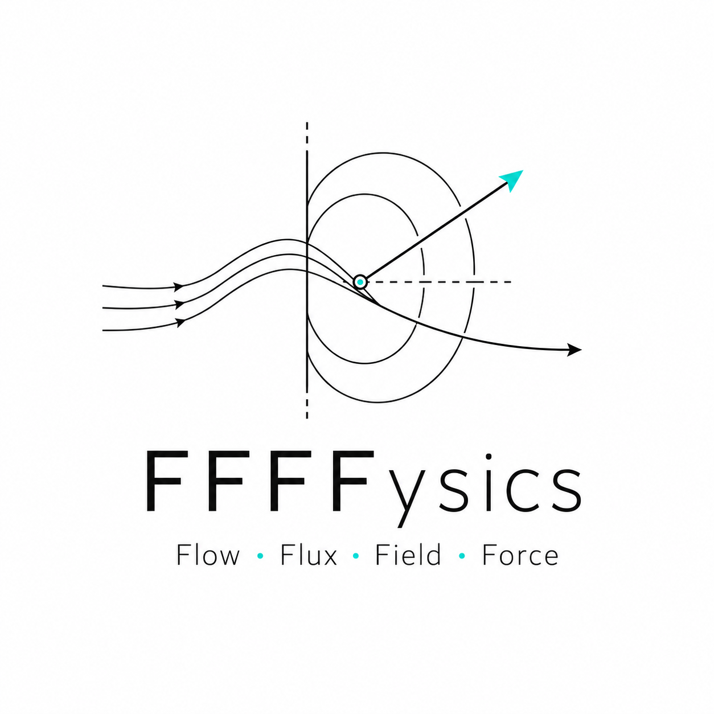

# FFFFysics

> Chasing **Flow, Flux, Field, and Force** — toward electromagnetic space propulsion.

<p align="center">
  
</p>

A research and knowledge archive at the intersection of **continuum mechanics** and **advanced plasma physics**, organized through four lenses:

- **Flow** — macroscopic dynamics of high-speed plasma fluids.
- **Flux** — magnetic and particle fluxes intersecting within the system.
- **Field** — electromagnetic fields that confine and govern the plasma.
- **Force** — the Lorentz force (thrust) that drives propulsion.

The site is a single static page: a research index, a Zettelkasten-style knowledge graph, and an editable note archive. It runs on GitHub Pages with no server or database.

**Live site:** https://FFFFysics.github.io/

---

## Research interests

- **Magnetohydrodynamics (MHD)** — computational modeling of non-ideal plasma, distinct from low-density electrostatic or Hall thrusters.
- **Space propulsion** — electromagnetic acceleration and energy conversion via magnetic reconnection.

## Tools

- **Physics / CFD** — MHD solvers, PIC simulation (e.g. Smilei)
- **Engineering** — topology optimization, lightweight structural design, HPC
- **Languages** — Python, C++, MATLAB

---

## Site structure

```text
FFFFysics.github.io/
├── index.html              # the whole site (research + knowledge graph)
├── sample-knowledge.json   # starter knowledge data
├── README.md
└── assets/
    ├── ffffysics-mark.png       # square mark (rail / favicon)
    └── ffffysics-lockup.png     # full lockup (About / social preview)
```

## Knowledge archive

Notes and relations are stored locally (browser `localStorage`) and can be backed up as JSON.

- **Backup** — `export` button writes a JSON file
- **Restore** — `import` button loads a JSON file
- Relations carry epistemic status: `direct`, `analogy`, `hypothesis`, `rejected`

Because GitHub Pages has no backend, edits live only in the editing browser until exported. Export periodically.

## Logo

The site falls back to an inline SVG mark, so it always renders even with no files. To use your own logo, commit PNGs to `assets/`: `ffffysics-mark.png` (square, rail/favicon) and `ffffysics-lockup.png` (full lockup, About/social). You can also preview a logo locally from the **About** page before committing (stored only in your browser).

---

✉️ **Contact:** [your email]
